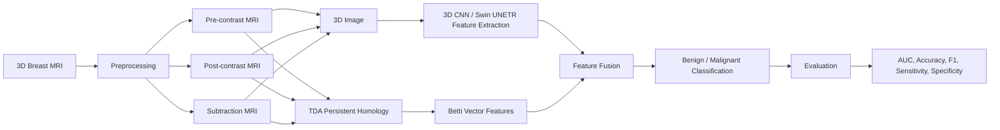

# Breast-MRI-TDA
<div align="center">

<!-- # Breast MRI TDA Fusion --->

### Topology Augmented Deep Learning for Breast MRI Classification

[]()
[]()
[]()
<!--[]()--->

</div>

---

## Overview

This repository contains the official implementation of our framework for breast MRI classification using **Topological Data Analysis (TDA)** and **3D deep learning**.

Our approach combines topological descriptors extracted from persistent homology with volumetric MRI representations learned by 3D convolutional neural networks and transformer-based architectures through a late-fusion framework.

The repository includes:

- 3D Breast MRI classification
- Image-only baselines
- Persistent homology using Cubical Complexes
- Betti Vector feature extraction
- TDA-only machine learning models
- TDA + image late fusion models
- Domain generalization experiments
<!--
- Training and evaluation scripts
- Hyperparameter search
- Preprocessing utilities
- Threshold tuning using validation F1
- Multi-seed evaluation

--->

## Pipeline



<!--
## Features

- 3D Breast MRI classification
- Persistent homology using Cubical Complexes
- Betti Vector feature extraction
- Late fusion of image and topology features
- Domain Generalization
- Hyperparameter search


## Repository Structure

```text
.
├── datasets/
├── preprocessing/
├── tda/
├── models/
│   ├── r3d18/
│   ├── r(2+1)d18/
│   ├── mc3_18/
│   └── swin_unetr/
├── late fusion/
├── hyperparameter_search/
├── training/
├── evaluation/
├── utils/
└── README.md
```

---
--->

## Installation
<!--
Clone the repository

```bash
git clone https://github.com/yourname/Breast-MRI-TDA.git

cd Breast-MRI-TDA
```
--->
### 1. Create environment
Conda (recommended):
```bash
conda create -n breast_tda python=3.10

conda activate breast_tda
```

### 2. Install dependencies

```bash
pip install -r requirements.txt
```

---

## Datasets

The experiments use breast MRI datasets collected from multiple institutions.

---

## Training

```bash
# 3D CNN Image only model
python train_image.py

# TDA model
python train_tda.py

# TDA + 3D-CNN Late Fusion model
python train_fusion.py
```

---

## Domain Generalization

The repository supports training on one dataset and evaluating on external datasets. For domain generalization we train the model with **Odelia** and do external tests on **FastMRI Breast** and **BreastDM** without any target domain fine tuning.
  
```bash
# Test 1 : Odelia --> FastMRI
python domain_generalization_fastmri.py

# Test 1 : Odelia --> BreastDM
python domain_generalization_breastdm.py
```

---
<!--
## Hyperparameter Search

Supported search options include

- Learning rate
- Weight decay
- Batch size
- Dropout
- Optimizer

Example

```bash
python random_search.py
```

---

## Results

Example evaluation metrics

| Model | AUC | Accuracy | Sensitivity | Specificity |
|-------|----:|---------:|------------:|------------:|
| Image Only | -- | -- | -- | -- |
| TDA | -- | -- | -- | -- |
| Fusion | -- | -- | -- | -- |

---

## Citation

If you find this repository useful, please cite our paper.

```bibtex
@inproceedings{anonymous2026,
  title={Title of the Paper},
  author={Anonymous},
  booktitle={IEEE BIBM},
  year={2026}
}
```

--->

## Acknowledgements

We would like to thank the dataset creators for their hard work in advancing open-source medical image analysis; the PyTorch and Torchvision contributors for the implementations of R3D-18, MC3-18, R(2+1)D-18; the MONAI developers for the implementation of SwinUNETR and the self-supervised pretrained SwinUNETR weights.

---
<!--
%## License

%This project is released under the MIT License.

--->
