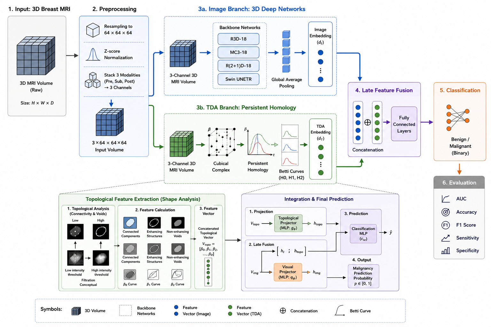

# Breast-MRI-TDA
<div align="center">

<!-- # Breast MRI TDA Fusion --->

### Topology Augmented Deep Learning for Breast MRI Classification

[]()
[]()
[]()
<!--[]()--->

</div>

---

## Overview

This repository contains the official implementation of our framework for breast MRI classification using **Topological Data Analysis (TDA)** and **3D deep learning**.

Our approach combines topological descriptors extracted from persistent homology with volumetric MRI representations learned by 3D convolutional neural networks (R3D-18, MC3-18, and R(2+1)D-18) and SwinUNETR architectures through a late-fusion framework.

The repository includes:

- 3D Breast MRI classification
- Image-only baselines
- Persistent homology using Cubical Complexes
- Betti Vector feature extraction
- TDA-only machine learning models
- TDA + image late fusion models
- Domain generalization experiments

## Framework

<p align="center">
  
</p>

<p align="center">
<b>Figure 1.</b> Overview of the proposed TDA-enhanced deep learning framework for breast MRI classification.
</p>


## Installation

### 1. Create environment
Conda (recommended):
```bash
conda create -n breast_tda python=3.10

conda activate breast_tda
```

### 2. Install dependencies

```bash
pip install -r requirements.txt
```

---

## Datasets

The experiments use breast MRI datasets collected from multiple institutions.

- [ODELIA](https://huggingface.co/datasets/ODELIA-AI/ODELIA-Challenge-2025/tree/main/example-algorithm)
- [BreastDM](https://github.com/smallboy-code/Breast-cancer-dataset)
- [FastMRI Breast](https://fastmri.med.nyu.edu/)

## Training

```bash
# 3D CNN Image only model
python train_image.py

# TDA model
python train_tda.py

# TDA + 3D-CNN Late Fusion model
python train_fusion.py
```

---

## Domain Generalization

The repository supports training on one dataset and evaluating on external datasets. For domain generalization we train the model with **Odelia** and do external tests on **FastMRI Breast** and **BreastDM** without any target domain fine tuning.
  
```bash
# Test 1 : Odelia --> FastMRI
python domain_generalization_fastmri.py

# Test 1 : Odelia --> BreastDM
python domain_generalization_breastdm.py
```

---

## Acknowledgements

We would like to thank the dataset creators for their hard work in advancing open-source medical image analysis; the PyTorch and Torchvision contributors for the implementations of R3D-18, MC3-18, R(2+1)D-18; the MONAI developers for the implementation of SwinUNETR and the self-supervised pretrained SwinUNETR weights.

---
